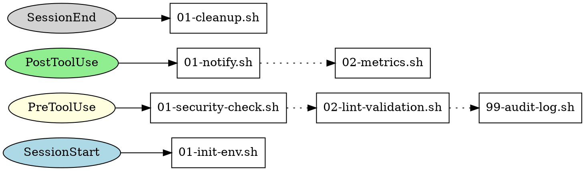

# Graph Visualization Requirements

## Overview

hooks-dispatch includes a `graph` command to visualize hook configurations. This aids debugging, documentation, and understanding event flow.

## Use Cases

1. **Debugging**: "Why did my hook not run?"
2. **Documentation**: Generate diagrams for project README
3. **Onboarding**: Understand existing hook setup
4. **Validation**: Verify configuration before deployment

## Command Interface

```bash
# Terminal output (default)
hooks-dispatch graph

# DOT format for Graphviz
hooks-dispatch graph --format=dot > hooks.dot
dot -Tpng hooks.dot -o hooks.png

# JSON for programmatic use
hooks-dispatch graph --format=json

# Filter to specific event
hooks-dispatch graph --event=PreToolUse
```

## Output Formats

### Terminal (Default)

ASCII representation for quick viewing:

```
hooks-dispatch graph

Event Flow:
===========

SessionStart
  └── 01-init-env.sh

PreToolUse
  ├── 01-security-check.sh
  ├── 02-lint-validation.sh
  └── 99-audit-log.sh

PostToolUse
  ├── 01-notify.sh
  └── 02-metrics.sh

SessionEnd
  └── 01-cleanup.sh

Legend: [mode: stop-on-failure] [timeout: 60s]
```

With `--verbose`:
```
PreToolUse [stop-on-failure, 30s timeout]
  ├── 01-security-check.sh (1.2KB)
  │     Blocks dangerous commands
  ├── 02-lint-validation.sh (3.4KB)
  │     Validates code style
  └── 99-audit-log.sh (0.5KB)
        Logs all tool usage
```

### DOT Format

For Graphviz rendering:



### JSON Format

For programmatic consumption:

```json
{
  "hooks_dir": "/home/user/project/hooks.d",
  "events": [
    {
      "name": "PreToolUse",
      "mode": "stop-on-failure",
      "timeout": 30,
      "scripts": [
        {
          "name": "01-security-check.sh",
          "path": "/home/user/project/hooks.d/PreToolUse/01-security-check.sh",
          "size": 1234,
          "executable": true,
          "order": 1
        },
        {
          "name": "02-lint-validation.sh",
          "path": "/home/user/project/hooks.d/PreToolUse/02-lint-validation.sh",
          "size": 3456,
          "executable": true,
          "order": 2
        }
      ]
    }
  ]
}
```

## Visual Elements

### Event Types (Color Coding)

| Event Category | Color | Examples |
|----------------|-------|----------|
| Session | Blue | SessionStart, SessionEnd |
| Pre-action | Yellow | PreToolUse |
| Post-action | Green | PostToolUse |
| Error | Red | PostToolUseFailure |

### Script States

| State | Symbol | Meaning |
|-------|--------|---------|
| Enabled | (none) | Normal script |
| Disabled | `_` prefix | Script won't run |
| Not executable | `?` | Missing +x (non-.sh files) |

### Execution Flow

- Solid arrows: Event triggers scripts
- Dotted arrows: Sequential execution order
- Red X: stop-on-failure break point

## Validation Warnings

The graph command reports issues:

```
hooks-dispatch graph

Warnings:
  ? PostToolUse/custom-script: not executable (missing +x)
  - PreToolUse/_disabled.sh: script disabled (underscore prefix)

Event Flow:
...
```

## Future Considerations

### Interactive Mode (v2)
```bash
hooks-dispatch graph --interactive
```
Opens TUI with:
- Navigate events with arrow keys
- Enter to see script details
- Toggle enable/disable

### Watch Mode (v2)
```bash
hooks-dispatch graph --watch
```
Live updates as hooks.d changes.

### Mermaid Output (v2)
```bash
hooks-dispatch graph --format=mermaid
```
For embedding in GitHub README.

## Implementation Priority

### Phase 1 (MVP)
- Terminal ASCII output
- JSON output
- Basic validation warnings

### Phase 2
- DOT format output
- Verbose mode with descriptions
- Event filtering

### Phase 3
- Interactive TUI
- Watch mode
- Mermaid format

## Design Rationale

1. **Terminal-first**: Most debugging happens in terminal. ASCII art works everywhere.

2. **DOT for diagrams**: Industry standard. Users can style with Graphviz.

3. **JSON for tooling**: Enables IDE plugins, CI validation, custom renderers.

4. **Validation built-in**: Catch misconfigurations before they cause runtime errors.

5. **Progressive enhancement**: Start simple, add formats as needed.
